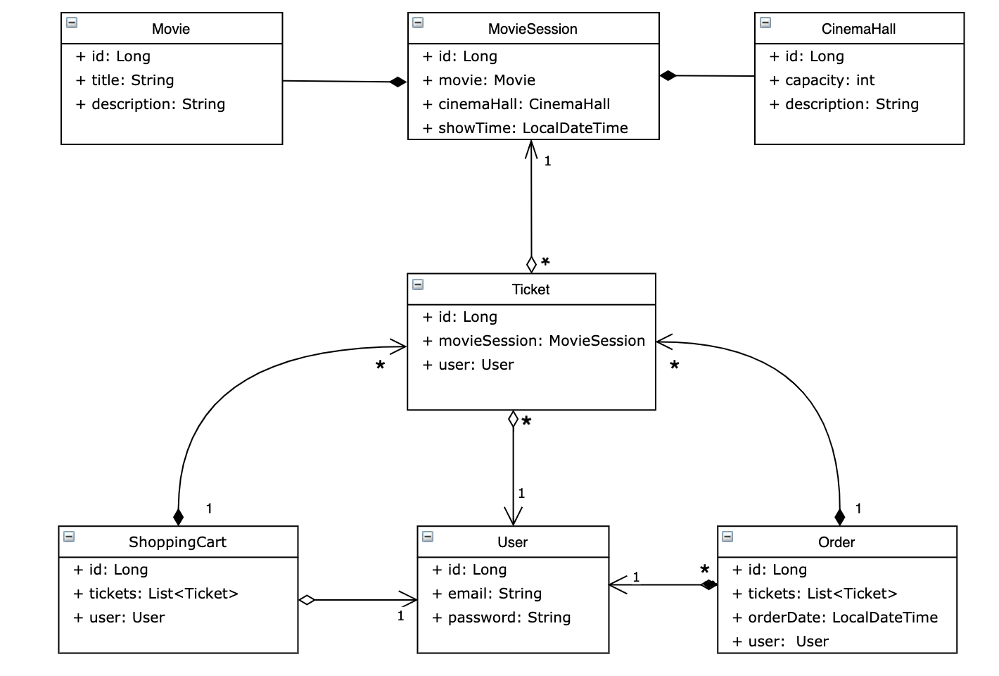

# Cinema-app

## Overview
#### Cinema-app is a web application where registered user clients can purchase tickets for a movie. Also, it gives a lot of tools for Admin users to perform CRUD operations on Movies, Cinema Halls, and Movie Sessions.

---

## Project structure
 Project is built on a three-tier architecture:

1. Presentation layer (controllers);
2. Application layer (service);
3. Data access layer (DAO);

Tables relation:

## List of all endpoints

* POST: /register - all
* GET: /cinema-halls - user/admin
* POST: /cinema-halls - admin
* GET: /movies - user/admin
* POST: /movies - admin
* GET: /movie-sessions/available - user/admin
* POST: /movie-sessions - admin
* PUT: /movie-sessions/{id} - admin
* DELETE: /movie-sessions/{id} - admin
* GET: /orders - user
* POST: /orders/complete - user
* PUT: /shopping-carts/movie-sessions - user
* GET: /shopping-carts/by-user - user
* GET: /users/by-email - admin

---
## Technologies stack

* Java 11
* Hibernate
* Spring Framework
* REST
* MySQL
* Apache Tomcat 9.0.54 (to run app locally)

---

## How to run project
### Necessary tools :
* Intellij IDEA Ultimate
* MySql
* Apache Tomcat

1. Clone this project
2. Add new configuration TomCat Local server
3. Change username and password in db.properties
4. Create schema in MySQL
5. Run the application
6. After running the application you will be redirected to login page. You can use:
   * adminName 'admin@t.com' and password '1234' for login as admin
   * userName 'dop@t.com' and password '1234567890' for login as user
7. Use Postman for sending your requests during testing this application
